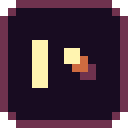
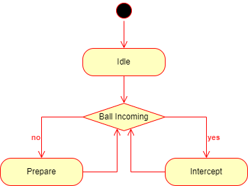
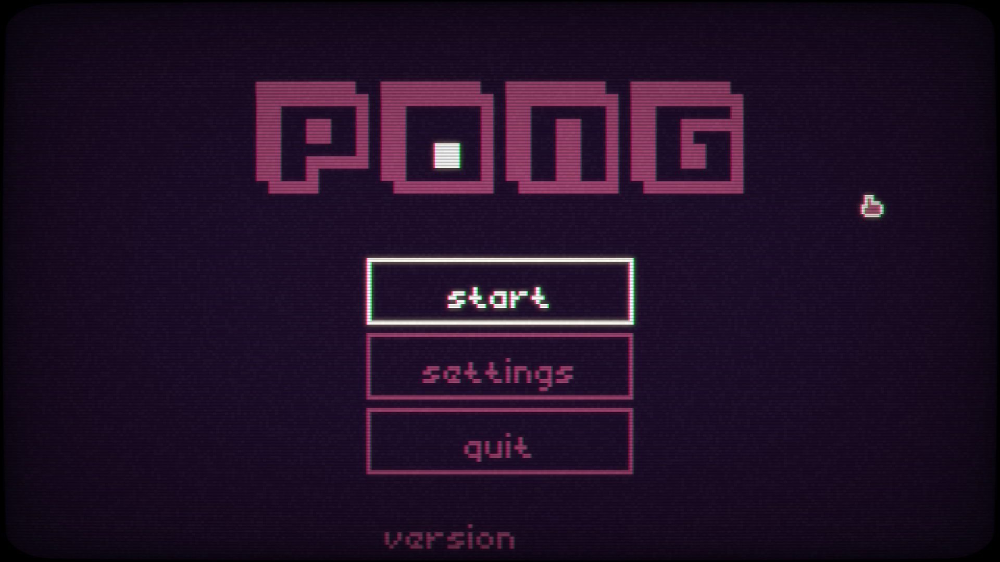
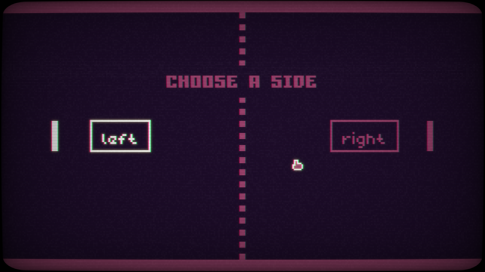
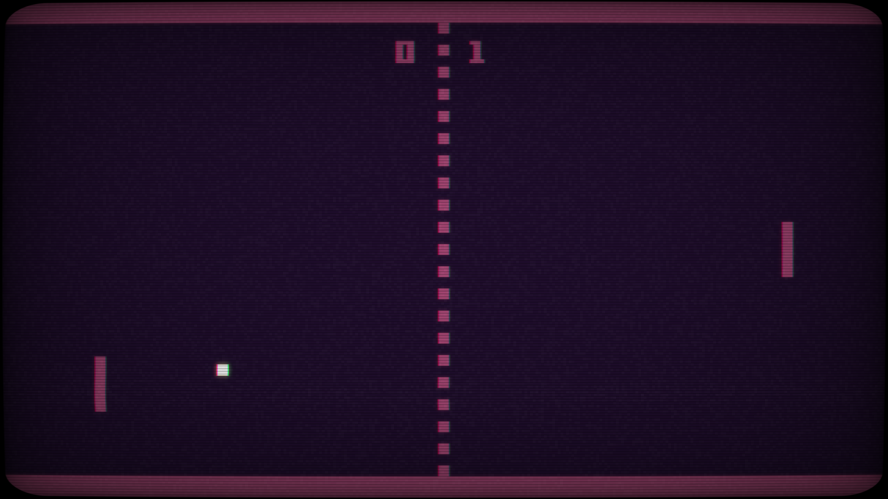

&nbsp;

Based on the classic [Atari Pong (1972)](https://en.wikipedia.org/wiki/Pong).

## Instructions

1. User Interface Navigation: Mouse / Keyboard (Arrows/Enter) / Controller (Left Stick + Button0)
2. Gameplay (One Player Mode):
    - Keyboard:
        - W/S or Up/Down Arrows to move up and down
        - Pause/Menu: P or Esc
    - Controller:
        - Left or Right Stick Up/Down to move up and down
        - Pause/Menu: Back or Start
3. Gameplay (Two Players Mode):
    - Keyboard:
        - Left Player: W/S to move up and down
        - Right Player: Up/Down Arrows to move up and down
        - Pause/Menu: P or Esc
    - Controller:
        - Left Player: Left Stick Up/Down to move up and down
        - Right Player: Right Stick Up/Down to move up and down
        - Pause/Menu: Back or Start

## Game rules

Just like table tennis, but shorter rounds: First to 7 points wins, unless deuce (both players reach 6 point), then play until one player is 2 points ahead, then that player wins.

First serve direction is random. Alternate serve direction every 2 rounds, unless deuce, then alternate serve direction every 1 round.

## Features

- One Player mode (versus bot).
- Two Player mode (local versus).
- Custom-made SFX.
- Custom-made art and animation.
- [Finite State Machine](https://en.wikipedia.org/wiki/Finite-state_machine) implementation.

## One player mode

For this mode, using my custom [Finite State Machine](https://en.wikipedia.org/wiki/Finite-state_machine). I have implemented a [Simple Reflex Agent](https://en.wikipedia.org/wiki/Intelligent_agent#Simple_reflex_agents) for the bot paddle. Its behavior follows this state diagram:

    

- `Idle` is the start state. It detects if the ball is coming away or toward from the bot paddle, then transition to the `Prepare` or `Intercept` state, respectively.
- `Prepare` moves the bot paddle to the center of the y-axis for maximum ball coverage, then wait until the ball is coming toward the bot paddle to transition to `Intercept` state.
- `Intercept` predicts where the ball will be in the next 60 physics frames, then tries to intercept the projected ball's y-coordinate if its x-coordinate matches that of the bot paddle. Transitions to `Prepare` immediately when the ball bounces away.

## Gallery

    
    
    

